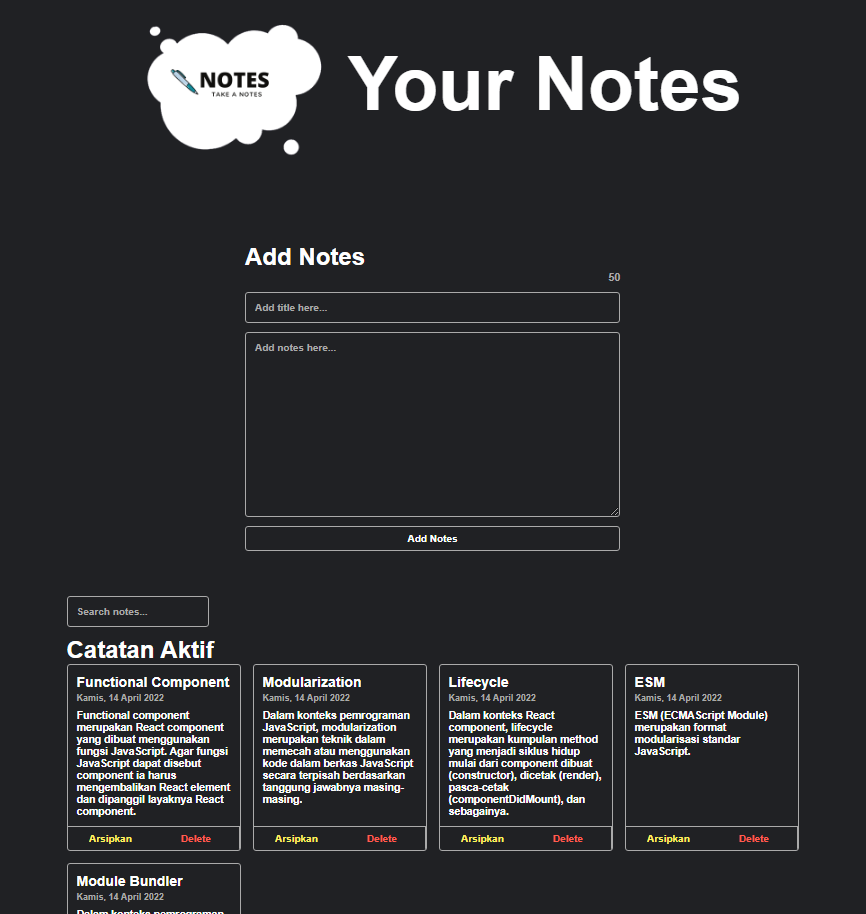

 

  <h3 align="center">Notes App</h3>

  

    A web-based note-taking app that can add, archive, and delete notes
     
     
    <a href="https://github.com/andynusantara/notes-app"><strong>Explore the docs »</strong></a>
     
     
    <a href="https://github.com/andynusantara/notes-app">View Demo</a>
    .
    <a href="https://github.com/andynusantara/notes-app/issues">Report Bug</a>
    .
    <a href="https://github.com/andynusantara/notes-app/issues">Request Feature</a>
  

     

## Table Of Contents

* [About the Project](#about-the-project)
* [Built With](#built-with)
* [Roadmap](#roadmap)
* [Contributing](#contributing)
* [Authors](#authors)
* [Acknowledgements](#acknowledgements)

## About The Project

A web-based note-taking application designed to streamline your digital note-keeping experience. With an intuitive and user-friendly interface, empowers you to effortlessly add, delete, and archive notes, ensuring that your thoughts and ideas are always organized and accessible.

Key Features:
- Effortless Note Creation:
WebNotes makes jotting down your thoughts a breeze. With a simple and clean design, you can quickly create new notes and capture important information as it comes to you.

- Seamless Note Management:
Whether you need to delete outdated information or archive important notes for future reference, this app provides a seamless note management experience. Your digital workspace stays clutter-free, allowing you to focus on what matters.

- Archive Functionality:
Archive notes that you want to keep but don't need in your active workspace. Retrieve them whenever necessary, ensuring that your important information is never lost.

- Responsive Design:
Access your notes anytime, anywhere.  Designed to be responsive across devices, ensuring a consistent experience whether you're using a computer, tablet, or smartphone.

-Search Functionality:
Quickly find the note you're looking for with the powerful search feature. Helps you locate information within seconds, saving you time and effort.

## Built With

- Frontend Framework:
Employs a responsive and dynamic user interface built with a modern frontend framework. The use of technologies like React.js ensures a smooth and interactive user experience, allowing users to navigate, create, and manage notes with ease.

- Responsive Design:
WebNotes is designed to be accessible across various devices and screen sizes. Responsive design techniques, possibly employing CSS Grid or Flexbox, ensure a consistent and user-friendly experience whether you're using a desktop, tablet, or mobile device.

## Roadmap

See the [open issues](https://github.com/andynusantara/notes-app/issues) for a list of proposed features (and known issues).

## Contributing

Contributions are what make the open source community such an amazing place to be learn, inspire, and create. Any contributions you make are **greatly appreciated**.
* If you have suggestions for adding or removing projects, feel free to [open an issue](https://github.com/andynusantara/notes-app/issues/new) to discuss it, or directly create a pull request after you edit the *README.md* file with necessary changes.
* Please make sure you check your spelling and grammar.
* Create individual PR for each suggestion.
* Please also read through the [Code Of Conduct](https://github.com/andynusantara/notes-app/blob/main/CODE_OF_CONDUCT.md) before posting your first idea as well.

### Creating A Pull Request

1. Fork the Project
2. Create your Feature Branch (`git checkout -b feature/AmazingFeature`)
3. Commit your Changes (`git commit -m 'Add some AmazingFeature'`)
4. Push to the Branch (`git push origin feature/AmazingFeature`)
5. Open a Pull Request

## Authors

* **Andy Wijaya Nusantara** - *Tarumanagara University Student* - [Andy Wijaya Nusantara](https://github.com/andynusantara/) - *designed, coded, and implemented each feature*

## Acknowledgements

* [Andy Wijaya Nusantara](https://github.com/AndyNusantara)
* [ReactJS](https://react.dev/)
* [Vite](https://vitejs.dev/)
